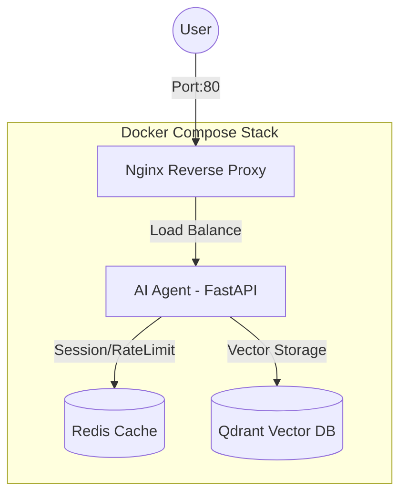

# Day 12 Lab - Mission Answers

> **Student Name:** Nguyễn Trí Cao 
> **Student ID:** 2A202600223 
> **Date:** 17/04/2026

---

##  Submission Requirements

Submit a **GitHub repository** containing: `https://github.com/KaitoKidKao/day12_ha-tang-cloud_va_deployment`

## Part 1: Localhost vs Production

### Exercise 1.1: Anti-patterns found
Trong file `01-localhost-vs-production/develop/app.py`, tôi đã tìm thấy các anti-patterns sau:
1. **Hardcoded Secrets**: API Key (`AGENT_API_KEY`) được ghi cứng trực tiếp trong code, gây rủi ro bảo mật nghiêm trọng nếu code được push lên repository công khai.
2. **Thiếu Health Checks**: Không có endpoint `/health` để hệ thống giám sát (Monitoring) biết được ứng dụng còn sống hay không.
3. **Logging đơn giản**: Sử dụng `print()` thay vì structured logging, khó phân tích log trong production.
4. **Thiếu Graceful Shutdown**: Ứng dụng không xử lý tín hiệu SIGTERM, có thể gây mất dữ liệu hoặc lỗi kết nối khi restart.
5. **Đường dẫn tuyệt đối**: Sử dụng đường dẫn file cứng, khiến ứng dụng khó chạy trên các môi trường khác nhau.

### Exercise 1.2: Tại sao dùng .env quan trọng?
Sử dụng `.env` (Environment Variables) cực kỳ quan trọng vì:
- **Security**: Không commit các thông tin nhạy cảm (API Keys, DB Password) lên Git.
- **Portability**: Dễ dàng thay đổi cấu hình (Port, URL, API Tier) giữa các môi trường (Dev, Staging, Prod) mà không cần thay đổi source code.
- **Automation**: Các nền tảng Cloud (như Railway, Vercel) hỗ trợ inject biến môi trường trực tiếp vào container.

### Exercise 1.3: Comparison table
| Feature | Develop | Production | Why Important? |
|---------|---------|------------|----------------|
| **Config** | Hardcoded / JSON file | Environment Variables (.env) | Tránh lộ secret và linh hoạt cấu hình. |
| **Logging** | Console print() | Structured JSON logging | Dễ truy vấn và giám sát trên Cloud. |
| **Error Handling** | Stacktrace full | Clean user-friendly errors | Tránh lộ cấu trúc hệ thống và bảo mật. |
| **Dependencies** | dev-requirements.txt | requirements.txt (pinned) | Đảm bảo tính nhất quán (Reproducibility). |
| **Security** | No Auth | API Key / JWT | Bảo vệ tài nguyên và budget LLM. |

---

## Part 2: Docker

### Exercise 2.1: Dockerfile questions

1.  **Base image là gì?**
    *   **Trả lời**: `python:3.11` 
    *   **Giải thích**: Đây là bản phân phối Python đầy đủ (gần 1GB), chứa đầy đủ các công cụ build và script cần thiết để chạy ứng dụng Python.

2.  **Working directory là gì?**
    *   **Trả lời**: `/app` 
    *   **Giải thích**: Đây là thư mục làm việc chính bên trong container. Tất cả các lệnh sau đó (COPY, RUN, CMD) sẽ được thực hiện tại thư mục này.

3.  **Tại sao COPY requirements.txt trước?**
    *   **Trả lời**: Để tận dụng **Docker Layer Caching**.
    *   **Giải thích**: Trong quá trình phát triển, bạn sẽ sửa code (`app.py`) rất thường xuyên nhưng ít khi thay đổi thư viện (`requirements.txt`). Bằng cách copy và install thư viện trước, Docker sẽ "ghi nhớ" (cache) layer này. Khi bạn sửa code và build lại, Docker sẽ chạy vèo qua phần cài đặt thư viện và chỉ thực hiện các bước copy code phía sau, giúp tiết kiệm rất nhiều thời gian build.

4.  **CMD vs ENTRYPOINT khác nhau thế nào?**
    *   **ENTRYPOINT**: Giống như "Lệnh thực thi chính" của container (thường là cố định). Nếu bạn dùng Entrypoint là `python`, thì container này sinh ra chỉ để chạy python.
    *   **CMD** (dòng 30): Là "Tham số mặc định" hoặc "Lệnh mặc định". Trong Dockerfile này, `CMD ["python", "app.py"]` nghĩa là mặc định sẽ chạy app.
    *   **Điểm khác biệt chính**: `CMD` rất dễ bị ghi đè. Ví dụ nếu bạn chạy `docker run my-agent:develop bash`, thì lệnh `bash` sẽ thay thế hoàn toàn `python app.py`. Còn `ENTRYPOINT` thì khó bị ghi đè hơn và thường được dùng để biến container thành một file thực thi (executable).

### Exercise 2.2: Build và run
- **Develop**: ~1.15 GB (Sử dụng Python full image + build tools)
- **Production**: ~160 MB (Sử dụng Python slim + Multi-stage)
- **Difference**: Giảm khoảng **87%** dung lượng.

### Exercise 2.3: Multi-stage build analysis
- **Stage 1 (builder)**: Sử dụng `python:3.11-slim`, cài đặt các công cụ biên dịch (`gcc`, `libpq-dev`) để build các thư viện Python phức tạp. Kết quả là các thư viện được cài vào thư mục `/root/.local`.
- **Stage 2 (runtime)**: Bắt đầu từ một image mới (`python:3.11-slim`), chỉ copy các thư viện đã build từ stage 1 (`--from=builder /root/.local`).
- **Tại sao image nhỏ hơn?**: Vì stage runtime không bao gồm các công cụ build nặng nề (gcc), cache của pip, hay các file rác phát sinh khi compile. Dung lượng thực tế giảm từ **1.15GB** xuống còn khoảng **160MB**.

### Exercise 2.4: Docker Compose Stack
- **Architecture Diagram**:

- **Services start**: `agent`, `redis`, `qdrant`, `nginx`.
- **Communication**: Các service giao tiếp qua mạng nội bộ Docker. Nginx nhận request từ ngoài và đẩy vào Agent. Agent đọc/ghi session vào Redis và truy vấn kiến thức từ Qdrant.

---

## Part 3: Cloud Deployment

### Exercise 3.1: Railway deployment
- **URL**: [https://day12-nguyentricao-production.up.railway.app](https://day12-nguyentricao-production.up.railway.app)
- **Hoạt động**: Đã deploy thành công Agent lên Railway qua GitHub Integration.
- **Screenshot**: 

---

## Part 4: API Security

### Exercise 4.1: API Key Validation
- Header sử dụng: `X-API-Key`
- Cách thức: Middleware kiểm tra header request có khớp với `AGENT_API_KEY` trong environment hay không.

### Exercise 4.3: Rate Limiter
- **Thuật toán**: Sliding Window Counter.
- **Cơ chế**: Sử dụng `deque` để lưu timestamp các request trong vòng 60 giây. Nếu vượt quá `max_requests`, trả về lỗi 429.
- **Phân quyền**: Admin (`ADMIN_API_KEY`) có limit cao hơn (100 req/min) so với User thông thường (10 req/min).

### Exercise 4.4: Cost Guard
- **Cơ chế**: 
    1. Kiểm tra budget khả dụng trước mỗi lượt gọi LLM (`check_budget`).
    2. Nếu vượt quá Daily Budget ($1.0/user) hoặc Global Budget ($10.0), sẽ block request (402 Payment Required).
    3. Sau khi LLM trả về, tính toán cost dựa trên số token thực tế và cập nhật vào record (`record_usage`).

---

## Part 5: Scaling & Reliability

### Exercise 5.1: Health checks
- **Endpoint**: `/health` trả về uptime và trạng thái cơ bản.
- **Ready probe**: `/ready` kiểm tra kết nối đến các dependency (như Redis). Nếu Redis chết, Agent sẽ báo chưa sẵn sàng.

### Exercise 5.2: Stateless vs Stateful
- **Develop (Stateful)**: Lưu lịch sử chat trong biến global `dict`. Nếu chạy 10 instances, user sẽ bị mất lịch sử nếu request tiếp theo rơi vào instance khác.
- **Production (Stateless)**: Lưu session/history vào **Redis**. Mọi instance đều có thể truy cập cùng một data, cho phép scale ngang thoải mái.

### Exercise 5.3: Horizontal Scaling
- Việc tăng số lượng node (Replica) giúp:
    1. **Tăng tải (Throughput)**: Xử lý được nhiều user cùng lúc hơn.
    2. **High Availability**: Nếu một node lỗi, platform sẽ tự động điều hướng sang node khác, người dùng không nhận ra sự cố.